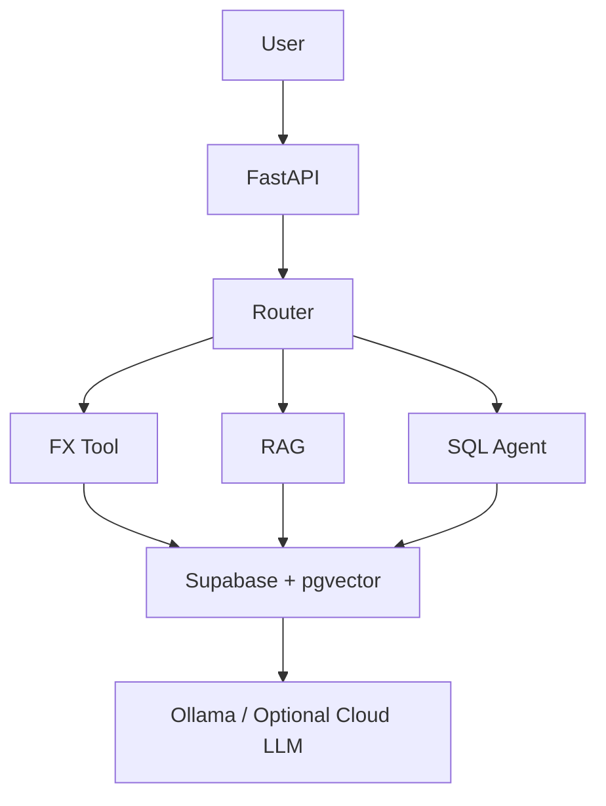

# FinFX AI Assistant

FinFX AI Assistant is a fintech-style AI and data engineering portfolio project. It combines live FX rates, transfer capture, Supabase/Postgres reporting, local Ollama LLM workflows, document RAG, schema RAG, and AI observability in one FastAPI application.

The project is designed for learning and demonstration. All sample data and knowledge documents are synthetic.

## What It Does

- Shows live and historical FX rates using the Frankfurter public API.
- Converts currencies and shows both full converted amount and 1-unit exchange rate.
- Lets a user create transfer records and persist them to SQL.
- Uses Supabase/Postgres for transfer records, LLM usage logs, question logs, document vectors, and schema vectors.
- Provides a customer-facing AI assistant for FX, transfer FAQ, policy, compliance, and support questions.
- Provides Admin Reports with a transfer dashboard and AI observability dashboard.
- Uses local Ollama for chat/planning and embeddings.
- Supports optional OpenAI or Anthropic chat providers while keeping embeddings local.
- Uses pgvector for persistent document RAG and persistent Admin SQL schema RAG.

## Architecture At A Glance



## Documentation

- [Local setup](docs/LOCAL_SETUP.md) - required software, `.env`, Ollama, Supabase, vector indexing, and common issues.
- [LLM, RAG, and vector architecture](docs/AI_RAG_LLM.md) - concepts, Ollama vs cloud LLMs, embeddings, pgvector, and routing layers.
- [AI flow charts](docs/AI_FLOW_CHARTS.md) - Ask AI and Admin Reports SQL flows with LLM, RAG, and vector-search steps.
- [Supabase SQL setup](docs/SUPABASE_SQL_SETUP.md) - database scripts and how table/vector setup works.
- [System architecture](docs/architecture.md) - service-level architecture notes.
- [Roadmap](docs/roadmap.md) - completed features and future improvements.

## Tech Stack

- Backend: Python, FastAPI, Pydantic
- Frontend: HTML, CSS, JavaScript
- Database: SQLite for local fallback, Supabase/Postgres for persistent records
- Vector store: Supabase pgvector
- Local AI: Ollama
- Default chat model: `llama3.2:3b`
- Default embedding model: `nomic-embed-text`
- Testing: Pytest
- FX provider: Frankfurter, with optional Alpha Vantage and FRED extensions

## Third-Party Tools And Services

Official links:

- [FastAPI](https://fastapi.tiangolo.com/) - Python API framework.
- [Supabase](https://supabase.com/) - hosted Postgres database used for persistent SQL data.
- [Supabase pgvector](https://supabase.com/docs/guides/database/extensions/pgvector) - vector search extension used for document RAG and schema RAG.
- [Ollama](https://ollama.com/) - local LLM runtime used for chat, planning, SQL generation, and embeddings.
- [Frankfurter](https://frankfurter.dev/) - free public FX rates API used for live and historical exchange rates.
- [OpenAI Platform](https://platform.openai.com/docs/) - optional cloud LLM provider.
- [Claude / Anthropic Docs](https://docs.anthropic.com/) - optional cloud LLM provider.
- [Alpha Vantage](https://www.alphavantage.co/documentation/) - optional FX/time-series provider.
- [FRED API](https://fred.stlouisfed.org/docs/api/fred/) - optional macroeconomic data provider.
- [Pytest](https://docs.pytest.org/) - Python test framework.

## Project Structure

```text
finfx-ai-assistant/
  app/
    api/                 FastAPI routes
    core/                settings and environment config
    models/              request schemas
    services/            FX, RAG, SQL, transfer, database, and LLM services
    static/              browser UI
  data/
    knowledge/           synthetic markdown policy and FAQ docs
    fx_rates.json        local fallback rates
    transactions.csv     synthetic demo transaction data
  docs/
    AI_RAG_LLM.md        LLM, RAG, vector, and knowledge architecture
    AI_FLOW_CHARTS.md    Ask AI and Admin SQL flow charts
    LOCAL_SETUP.md       local developer setup guide
    SUPABASE_SQL_SETUP.md Supabase SQL setup guide
    architecture.md      system architecture notes
    roadmap.md           future roadmap
  scripts/
    supabase_pgvector.sql
    supabase_schema_pgvector.sql
    supabase_llm_usage.sql
  tests/
    test_services.py
```

## Run Locally

Use [docs/LOCAL_SETUP.md](docs/LOCAL_SETUP.md) for the full local setup guide.

Quick start after dependencies and `.env` are ready:

```powershell
python -m uvicorn app.main:app --reload
```

Open:

- App: http://127.0.0.1:8000
- API docs: http://127.0.0.1:8000/docs

Supabase and pgvector setup is documented in [docs/SUPABASE_SQL_SETUP.md](docs/SUPABASE_SQL_SETUP.md).

## Main UI Areas

The main dashboard includes:

- AI assistant
- Live FX tool
- Live exchange-rate table
- Customer transfer form
- Provider status
- In-memory LLM usage summary

Admin Reports includes:

- Transfer dashboard
- Natural-language SQL analytics
- AI observability dashboard
- Persisted LLM usage logs
- Persisted assistant question logs

The Admin Reports login is demo-only and uses fixed frontend credentials. It is not production authentication.

## Sample Questions

Customer AI assistant:

```text
my payment failed, what to do, how to contact support
what documents are required for a high value transfer?
why is my payment delayed?
what is suspicious activity?
what is the GBP to INR rate?
gbp/inr trend in last 30 days
will GBP/INR increase next month?
```

Admin Reports SQL:

```text
last transaction
recent transfers
transfer summary
gbp to inr last payment
GBP TO INR HIGHEST TRANSFER
highest GBP amount transferred
which llm provider used most tokens?
which assistant route had the slowest latency?
show recent assistant questions
```

## Testing

The service suite includes focused coverage for FX conversion, RAG fallback behaviour, SQL safety validation, transfer creation, Admin report summaries, LLM usage logging, schema RAG, and assistant routing.

```powershell
python -m pytest tests\test_services.py --basetemp .pytest-tmp
python -m compileall app
node --check app\static\app.js
node --check app\static\reports.js
```

## GitHub Safety Checklist

Before pushing:

- Confirm `.env` is not staged.
- Confirm `finfx.db` is not staged.
- Confirm `.venv/`, `.pytest_cache/`, and `.pytest-tmp/` are not staged.
- Stage only source, docs, scripts, tests, and `.env.example`.
- Use `.env.example` for placeholders only.

Useful commands:

```powershell
git status --short
git add .gitignore .env.example README.md app data docs scripts tests requirements.txt
git status --short
```

## Disclaimer

This is a learning and portfolio project. It is not financial advice, not a production compliance system, and not suitable for real customer payments without proper security, audit, data protection, and regulatory review.
