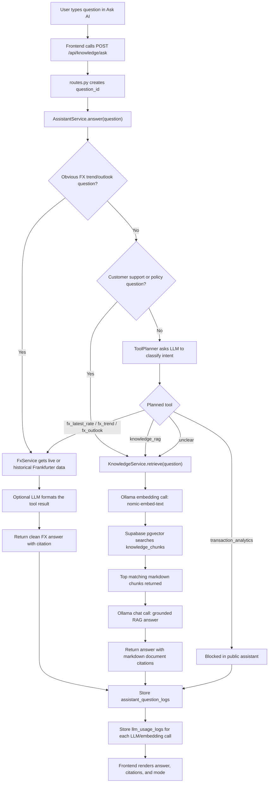
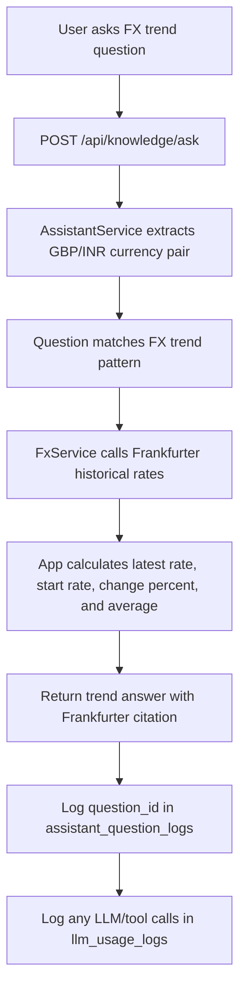
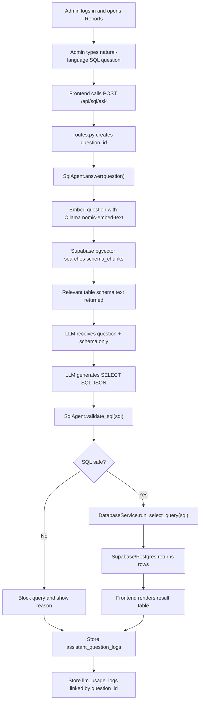
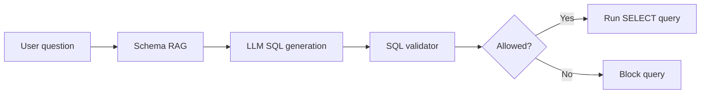

# AI Flow Charts

This document shows how FinFX AI Assistant handles user questions in two places:

- Customer-facing Ask AI
- Admin Reports natural-language SQL

The diagrams focus on the LLM calls, RAG steps, vector search, tool usage, and logging.

## 1. Customer Ask AI Flow

Example question:

```text
my payment failed, what to do, how to contact support
```

High-level flow:



What happens in this example:

1. The app receives the question and creates a unique `question_id`.
2. `AssistantService` sees it is a customer support/payment issue.
3. `KnowledgeService` embeds the question with local Ollama `nomic-embed-text`.
4. Supabase pgvector searches `knowledge_chunks`.
5. The most relevant markdown sections are sent to the chat model.
6. The LLM answers only from retrieved context.
7. The answer, citations, route mode, latency, and token usage are logged.

Main files involved:

```text
app/api/routes.py
app/services/assistant_service.py
app/services/tool_planner.py
app/services/knowledge_service.py
app/services/ollama_client.py
app/services/database_service.py
```

## 2. Customer Ask AI FX Example

Example question:

```text
gbp/inr trend in last 30 days
```



Important point:

This path usually does not use document RAG because the answer comes from live/historical FX data, not internal policy documents.

## 3. Admin Reports SQL Flow

Example question:

```text
highest GBP amount transferred
```

High-level flow:



What happens in this example:

1. The admin question is received by `/api/sql/ask`.
2. The app embeds the admin question locally with Ollama.
3. Supabase pgvector searches `schema_chunks`, not customer data.
4. The LLM receives only schema descriptions, for example columns in `transfers`.
5. The LLM generates a read-only `SELECT` query.
6. The code validates the SQL before running it.
7. Only safe `SELECT` queries against allowed tables are executed.
8. Results are shown only inside Admin Reports.

Main files involved:

```text
app/api/routes.py
app/services/sql_agent.py
app/services/ollama_client.py
app/services/database_service.py
app/static/reports.js
```

## 4. Admin SQL Safety Layer

The Admin SQL flow has two protections:



The SQL validator allows only a small read-only reporting subset:

- `SELECT` only
- allowed tables only
- allowed columns only
- no `INSERT`, `UPDATE`, `DELETE`, `DROP`, `ALTER`, or `CREATE`
- no multiple statements
- no comments
- no joins or set operations in the current demo version
- `LIMIT` is added when needed

## 5. Where Vectors Are Used

FinFX currently uses two vector stores in Supabase pgvector:

```text
knowledge_chunks
```

Stores embedded markdown policy/FAQ sections. Used by customer Ask AI document RAG.

```text
schema_chunks
```

Stores embedded table descriptions. Used by Admin Reports SQL schema RAG.

The user question is embedded at runtime. The app compares that embedding with stored embeddings and retrieves the closest matching chunks.

## 6. LLM Calls By Flow

Customer policy/support question:

```text
1 embedding call -> search knowledge_chunks
1 chat call -> grounded final answer
```

Customer FX question:

```text
0 or 1 chat call
Frankfurter data is the source of truth
```

Customer ambiguous question:

```text
1 JSON/chat call -> choose route
then possibly 1 embedding call + 1 chat call for RAG
```

Admin SQL question:

```text
1 embedding call -> search schema_chunks
1 JSON/chat call -> generate SQL
0 chat calls after SQL execution
```

## 7. Simple Mental Model

```text
LLM = understands language and writes answers/plans
Embedding = converts text into numbers
Vector DB = finds similar text by comparing those numbers
RAG = retrieves trusted context first, then asks the LLM to answer from that context
SQL validator = protects the database before generated SQL is executed
```

